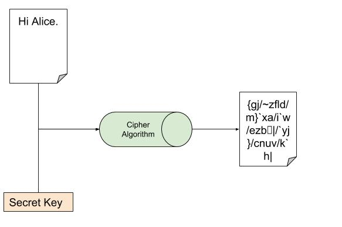
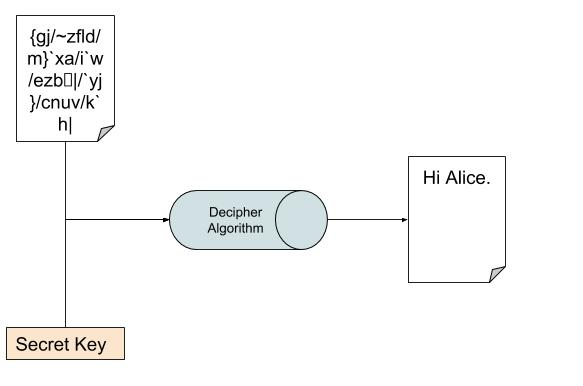
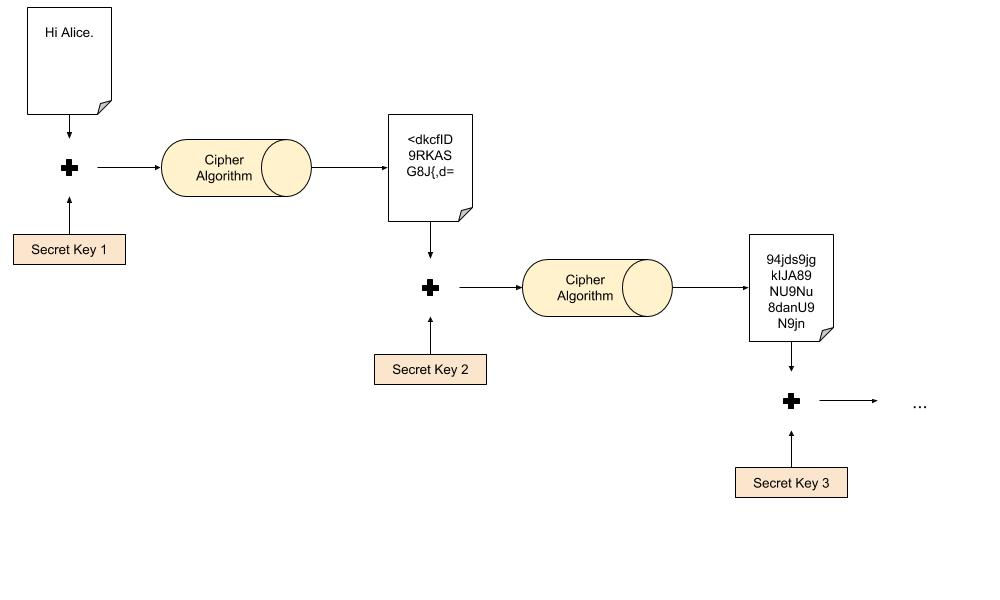
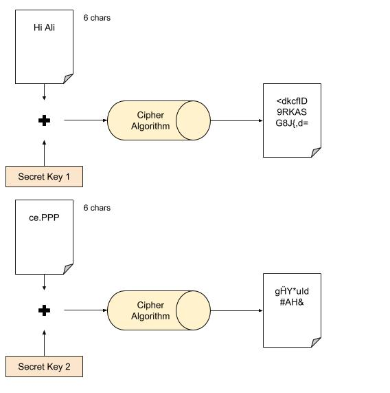

# Criptografia

* Texto plano
  * Texto não criptografado
* Texto cifrado
  * Texto criptografado

---

* Cifrar
  * Tornar **texto plano** em **texto cifrado**
* Decifrar
  * Tornar **texto cifrado** em **texto plano**

---

* Chave
  * Valor númerico utilizado para **cifrar** ou **decifrar**
  * Deve ser gerado a partir de um gerador de números aleatórios (RNG)
    * Um bom RNG leva em conta várias coisas como entrada: tempo, temperatura do equipamento, barulho, corrente eletrica, ...

# Criptografia Simétrica

* Chave secreta
  * **Chave** utilizada para **cifrar** e **decifrar**
  * O algoritmo de cifragem não é necessariamente o mesmo que o de decifrar, embora a chave seja a mesma em ambos
  * O texto cifrado é quase o mesmo tamanho do texto plano.  

\*Essa imagens não estão corretas pois o texto cifrado está bem maior que o texto plano (erro meu... sorry)   
  
  

* Tabela de chaves
  * Você gera N chaves (K1, K2, ..., KN) e utiliza em ordem cada uma delas para cifrar
    * Para decifrar você deve usar a ordem inversa (KN, ..., K2, K1)
  * Ex: DES, Triple DES

  

* Cifragem de bloco
  * Você divide o texto plano em blocos de tamanho igual e cifra cada uma com uma chave
    * Se ficar faltando espaço para terminar o último bloco, você preenche com valor de enchimento (padding) para completar o bloco   
  * Trabalha com tabela de chaves justamente para cifrar cada bloco com uma chave especifica
  * Ex: PKCS5

  

* XOR 
  * Método simples de cifragem
  * Cifrar: executar um XOR da chave secreta com texto plano
  * Decifrar: executar um XOR da chave secreta com texto cifrado

|            |  0  |  1  |
| ---------- | --- | --- |
|  <b>0</b>  |  0  |  1  |
|  <b>1</b>  |  1  |  0  |

Cifrando  
Texto plano: 0101-0111  
Chave secreta: 1111-0011  
\---------------------------------  
Texto cifrado: 1010-0100  

Decifrando  
Texto cifrado: 1010-0100  
Chave secreta: 1111-0011  
\---------------------------------  
Texto plano: 0101-0111  

* Cifragem de fluxo
  * //TODO
