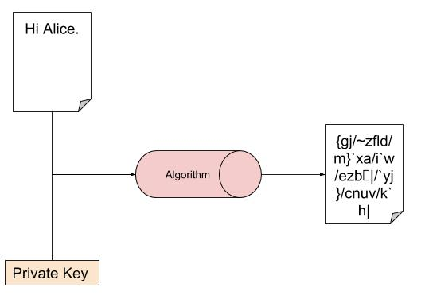
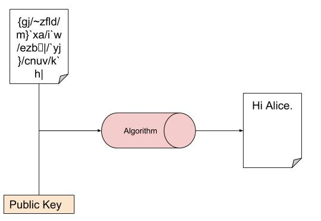
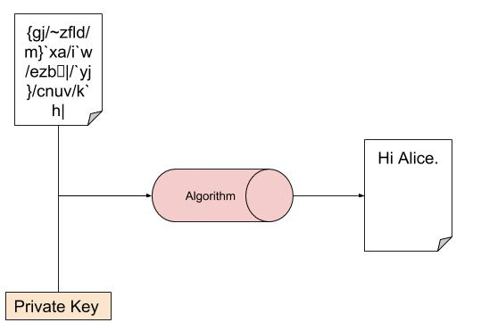
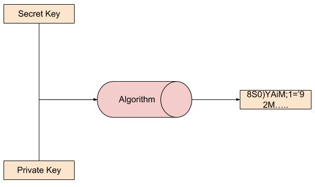
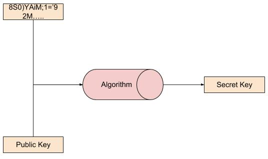
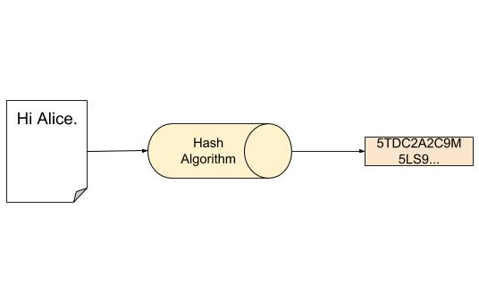

# Criptografia Assimétrica

* Chave pública
  * **Chave** par da chave privada
  * Utilizando essa chave você pode decifrar aquilo cifrado com **chave privada**
  * Chave conhecida por todos
* Chave privada
  * **Chave** par da chave pública
  * Utilizando essa chave você pode decifrar aquilo cifrado com **chave pública**
  * Chave só conhecida pelo dono do par de chaves
* O algoritmo de cifragem não é necessariamente o mesmo que o de decifrar
* Criptografia Assimétrica é custoso
  * O texto cifrado acaba bem maior que o texto plano
  * O tempo de cifragem é maior que o da criptografia simétrica    

#### Cipher with private key
  
  

#### Cipher with public key
  
  

Vamos supor que temos Alice e Bob, cada um deles tem sua chave pública e privada.  

Lembrando que a chave pública de cada um é conhecida por todos (Alice conhece a chave pública de Bob e Bob conhece a chave pública de Alice). A chave privada apenas o dono da chave conhece.  

Lembrando também que as informações só podem ser recuperadas pela chave par da chave que foi usada para cifrar.  
Tudo cifrado pela chave privada da Alice, só pode ser recuperado pela chave pública de Alice.  
Tudo cifrado pela chave pública de Alice só pode ser recuperado pela chave privada de Alice.  

* Sigilo
  * Se Alice quer que apenas Bob seja capaz de ler a mensagem enviada por ela, ela pode simplesmente cifrar com a chave pública de Bob.  
  * Apenas Bob possui a chave privada para recuperar a informação, assim garantindo que apenas Bob consiga ler esssa mensagem.  

* Autenticidade
  * Se Alice quer que Bob saiba que a mensagem veio dela, ela pode simplesmente cifrar com a chave privada dela.  
  * Bob conhece a chave pública de Alice, se após decifrar a mensagem fizer sentido, então você sabe que só a Alice pode ter cifrado essa mensagem, ou seja, veio da Alice.  

Tudo ocorre perfeitamente se temos **certeza** que as chaves públicas são dos reais donos.  

# Man-in-the-middle
Se os dois pontos da comunicação já possuem a chave pública do outro ponto, em teoria estaria tudo seguro. Mas compartilhar a chave é o maior problema que podemos ter em qualquer modo de criptografia, pois pode ter alguém no meio da comunicação desdo início.  

* Man-in-the-middle
  * Precisa estar entre as duas conexões
    * Difícil de se fazer em uma rede aberta como internet
  * Precisa capturar a chave   

Conexão normal

  

Man-in-the-middle apenas ouvindo as mensagens  

  

Man-in-the-middle fingindo ser a outra conexão  

  

* Durante a primeira conexão  
  * Quando conexão A enviar a mensagem, man-in-the-middle poderá captura a mensagem e abrir da mesma maneira que a conexão B iria abrir.  
  * Com o texto plano obtido, o man-in-the-middle poderá alterar a mensagem e executar todos os protocolos de segurança (utilizando a chave pública e privada do man-in-the-middle).  
  * Quando o man-in-the-middle enviar a mensagem para conexão B, conexão B vai achar que a chave pública recebida é da conexão A quando na verdade é do man-in-the-middle.  

Se o man-in-the-middle fizer o mesmo durante a primeira conexão de B com A, ele obterá sucesso em fingir ser ambos em uma conexão.  

# Envelope Digital
Em inglês: Digital Envelope

  
  

# Resumo de Mensagem
Em inglês: Message Digest

  